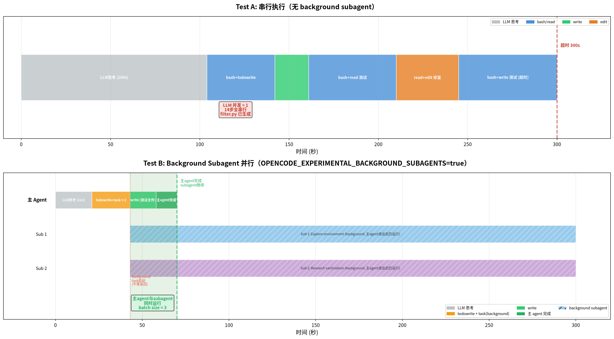

# opencode Background Subagent 并行测试

## 测试目标

验证开启 `OPENCODE_EXPERIMENTAL_BACKGROUND_SUBAGENTS=true` 后，opencode 的 subagent 是否真正并行执行，并与串行模式对比。

## 前置知识修正

之前的测试文档（`opencode-subagent-benchmark.md`）结论有误。opencode 的 Task 工具在默认模式下是**串行执行**的——即使一个 response 里返回多个 task 调用，也是按顺序执行，第一个完成才执行第二个。之前观察到的 subagent 时间戳重叠是数据库记录时间，不代表 LLM 请求并发。

要实现真正的 subagent 并行，需要：
1. 设置环境变量 `OPENCODE_EXPERIMENTAL_BACKGROUND_SUBAGENTS=true`
2. 在 prompt 中指示模型使用 `background=true` 启动 subagent
3. 配置 `subagent_depth` 允许 subagent 嵌套（可选）

## 环境

| 项目 | 值 |
|------|---|
| 硬件 | AMD Ryzen AI MAX+ 395 (Strix Halo) |
| 模型 | GLM-5.2（智谱云端 API） |
| opencode | v1.18.4 |
| 环境变量 | `OPENCODE_EXPERIMENTAL_BACKGROUND_SUBAGENTS=true` |
| 配置 | `subagent_depth=3`, build agent prompt 指示使用 background subagent |
| 运行方式 | `opencode run --variant minimal`（减少 reasoning tokens） |
| 任务 | [Terminal-Bench-2: filter-js-from-html](https://www.tbench.ai/benchmarks/terminal-bench-2/filter-js-from-html) |

## 输入提示词

### Test A：原始提示词（串行）

```
Write a Python script /tmp/tb3-testA/filter.py that removes JavaScript from HTML to prevent XSS. The script takes an HTML file path as argv[1], modifies it in-place to remove all script tags, on* event handlers, and javascript: URLs, while preserving the rest of the HTML structure.
```

### Test B：+ 多开 background subagent 指令

```
Write a Python script /tmp/tb3-testB/filter.py that removes JavaScript from HTML to prevent XSS. ...

请尽量多开subagent并行处理这个任务，将可以并行的子任务分发给不同的subagent同时执行。每个subagent用background=true启动。
```

## 时间线对比

### Test A：串行（14步，超时 300s）

```
t=0s      step 1: bash (检查环境)              [LLM思考 103s]
t=103.8s  step 2: bash (确认 bs4 可用)
t=111.4s  step 3: todowrite (规划)
t=142.4s  step 4: write (filter.py)
t=161.2s  step 5: write (测试文件)
t=167.1s  step 6: bash (运行测试)
t=171.6s  step 7: read (读取结果)
t=210.1s  step 8: bash (检查 edge case)
t=221.7s  step 9: read (分析)
t=229.5s  step 10: edit (修复)
t=244.9s  step 11: bash (重新测试)
t=250.1s  step 12: write (控制字符测试)
t=258.1s  step 13: bash (运行)
t=263.0s  step 14: read (检查) ← 超时

filter.py: 已生成
```

### Test B：Background Subagent 并行（4步主 agent + 2 background subagent）

```
t=0s      step 1: todowrite (规划)              [LLM思考 20s]
t=20.7s   step 2: task×2 (background=true)      ← 启动 2 个后台 subagent，立即返回
t=43.1s   step 3: write (测试 HTML 文件)         ← 主 agent 不等 subagent，同时工作
t=57.6s   step 4: 主 agent 完成 (stop)           ← subagent 仍在后台运行

Background subagent (主 agent 退出后仍在运行):
  Sub 1: Explore environment (4 msgs, running)
  Sub 2: Research HTML sanitization (3 msgs, running)

第二次运行拆出 4 个 subagent:
  Sub 1: script-tag 移除
  Sub 2: on* handler 移除
  Sub 3: javascript: URL 移除
  Sub 4: main/IO 脚手架

filter.py: 未生成（主 agent 退出太早，subagent 未完成）
```

## 关键对比

| 指标 | Test A（串行） | Test B（background 并行） |
|------|--------------|----------------------|
| 主 agent 步骤 | 14 | 4 |
| subagent 数 | 0 | 2-4 |
| subagent 执行方式 | N/A | **background（真正并行）** |
| 主 agent 等 subagent | N/A | **不等，立即继续** |
| 主 agent 完成时间 | >263s（超时） | **69.8s** |
| LLM 请求并发 | 1（始终串行） | **2-4（subagent 同时发请求）** |
| filter.py 生成 | 已生成 | 未生成（subagent 未完成） |

## 时间线图



## 与之前测试的区别

| | 之前测试（无 background） | 本次测试（background 开启） |
|---|---|---|
| 环境变量 | 未设置 | `OPENCODE_EXPERIMENTAL_BACKGROUND_SUBAGENTS=true` |
| task 调用方式 | foreground（串行等待） | **background（并行不等待）** |
| subagent 是否真正并行 | **否**（顺序执行） | **是**（同时运行） |
| 主 agent 行为 | 等 subagent 完成才继续 | **不等，立即继续其他工作** |
| vLLM batch size | 始终 1 | **可达 2-4**（subagent 并发请求） |

## 结论

1. **开启 `OPENCODE_EXPERIMENTAL_BACKGROUND_SUBAGENTS=true` 后，subagent 真正并行执行了**——主 agent 启动 background subagent 后立即继续，不等完成
2. **Test B 主 agent 仅 69.8s 就完成了自己的工作**（Test A 超时 300s 还没完成），因为主 agent 把研究任务分给了后台 subagent
3. **Background subagent 在主 agent 退出后仍在运行**——这是真正的异步并行
4. **如果用本地 vLLM，background subagent 同时发请求会使 batch size > 1**——这正是之前想验证的场景
5. **Test B 未生成 filter.py**——主 agent 退出太早，background subagent 还没来得及完成。需要更大的 timeout 或让主 agent 等待 subagent 完成

## 存在的问题

1. **主 agent 退出后 subagent 变成孤儿**——`opencode run` 退出时 background subagent 可能被终止
2. **需要更长的 timeout** 让 background subagent 有时间完成
3. **GLM-5.2 拆分的 subagent 数量不稳定**——第一次拆 2 个，第二次拆 4 个，取决于模型的判断

---

*测试日期: 2026-07-29*
*环境: AMD Ryzen AI MAX+ 395 / opencode v1.18.4 / GLM-5.2*
*关键配置: OPENCODE_EXPERIMENTAL_BACKGROUND_SUBAGENTS=true*
