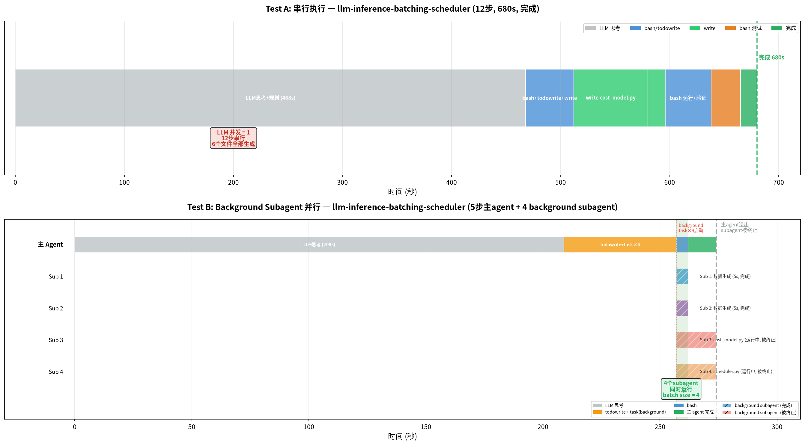

# opencode Background Subagent 并行测试 — llm-inference-batching-scheduler

## 测试目标

使用 Terminal-Bench-2 中的复杂任务 `llm-inference-batching-scheduler`（hard 难度），对比串行执行与 background subagent 并行执行的差异。

## 前置说明

之前的测试文档（`opencode-subagent-benchmark.md`）中关于"subagent 并行"的结论有误。opencode 的 Task 工具在默认模式下是串行执行的——即使一个 response 里返回多个 task 调用，也是按顺序执行。要实现真正的 subagent 并行，必须：
1. 设置 `OPENCODE_EXPERIMENTAL_BACKGROUND_SUBAGENTS=true`
2. 在 prompt 中指示模型使用 `background=true` 启动 subagent

## 环境

| 项目 | 值 |
|------|---|
| 硬件 | AMD Ryzen AI MAX+ 395 (Strix Halo) |
| 模型 | GLM-5.2（智谱云端 API） |
| opencode | v1.18.4 |
| 环境变量 | `OPENCODE_EXPERIMENTAL_BACKGROUND_SUBAGENTS=true`, `OPENCODE_EXPERIMENTAL=true` |
| 配置 | `subagent_depth=3`, build agent prompt 指示使用 background subagent |
| 运行方式 | `opencode run --variant minimal`（减少 reasoning tokens） |
| 任务 | [Terminal-Bench-2: llm-inference-batching-scheduler](https://www.tbench.ai/benchmarks/terminal-bench-2/llm-inference-batching-scheduler) |
| 任务难度 | hard |
| 无超时限制 | 等待任务自然完成 |

## 任务简介

实现一个 LLM 推理批处理调度器：
- 读取两个 bucket 的请求（request_id, prompt_len, gen_len）
- 将请求分配到 batch，每个 batch 使用固定 shape（seq_align=64 的倍数, heads_align=32, hidden_align=4096）
- 最多 8 种不同 shape
- 最小化 cost、pad ratio、P95 latency
- 输出 plan_b1.jsonl, plan_b2.jsonl, cost_model.py, scheduler.py

## 输入提示词

### Test A：原始提示词（串行）

```
Implement an LLM inference batching scheduler in /tmp/tb4-testA/. Read requests from requests_bucket_1.jsonl and requests_bucket_2.jsonl (create sample data if files don't exist), and produce optimized batching plans at plan_b1.jsonl and plan_b2.jsonl. Each request has request_id, prompt_len, gen_len. Assign to batches with shape (seq_align=multiple of 64, heads_align=32, hidden_align=4096). Max 8 unique shapes. Minimize cost, pad ratio, P95 latency. Also create cost_model.py and scheduler.py.
```

### Test B：+ Background Subagent 指令

```
（同上，输出目录改为 /tmp/tb4-testB/）

请尽量多开subagent并行处理这个任务，将可以并行的子任务分发给不同的subagent同时执行。每个subagent用background=true启动。

重要：启动所有background subagent后，你必须继续等待它们全部完成。不要停止。
```

## 时间线对比



### Test A：串行（12步，680s，完成）

```
t=0s      LLM 思考+规划 (468s，大量 reasoning tokens)
t=468s    step 1: bash (检查环境)
t=473s    step 2: todowrite (规划)
t=512s    step 3: write cost_model.py
t=580s    step 4: write scheduler.py
t=587s    step 5: todowrite (更新)
t=591s    step 6: bash (运行调度器)
t=595s    step 7: bash (验证)
t=617s    step 8: bash (独立验证)
t=639s    step 9: bash (基准测试)
t=660s    step 10: bash (结果分析)
t=665s    step 11: todowrite (完成)
t=680s    step 12: 完成 ✅ (全部文件生成)
```

### Test B：Background Subagent 并行（5步主 agent + 4 background subagent，274s）

```
t=0s      LLM 思考+规划 (209s)
t=209s    step 1: todowrite (规划)
t=257s    step 2: task×4 (background=true) ← 同时启动 4 个后台 subagent
          ├── Sub 1: 生成 requests_bucket_1.jsonl (5s, 完成)
          ├── Sub 2: 生成 requests_bucket_2.jsonl (5s, 完成)
          ├── Sub 3: 实现 cost_model.py (运行中)
          └── Sub 4: 实现 scheduler.py (运行中)
t=262s    step 3: bash (检查文件，确认 Sub 1/2 完成)
t=269s    step 4: todowrite (更新进度)
t=274s    step 5: 主 agent stop ← Sub 3/4 被终止

⚠️ 主 agent 退出后 background subagent 被终止，cost_model.py 和 scheduler.py 未生成
```

## 数据对比

| 指标 | Test A（串行） | Test B（background 并行） |
|------|--------------|----------------------|
| 主 agent 步骤 | 12 | 5 |
| 主 agent 耗时 | 680s | **274s** |
| subagent 数 | 0 | 4 |
| subagent 执行方式 | N/A | **background（真正并行）** |
| 主 agent 等 subagent | N/A | 部分等待（2/4 完成后退出） |
| LLM 请求并发 | 1 | **4（subagent 同时运行）** |
| input tokens | 43,054 | 18,715 |
| output tokens | 11,735 | 4,251 |
| reasoning tokens | 26,850 | 12,515 |
| 生成文件 | 6 个（全部完成） | 2 个（数据文件完成，代码文件未完成） |

### 生成文件对比

| 文件 | Test A | Test B |
|------|--------|--------|
| requests_bucket_1.jsonl | 17,886 bytes | 3,560 bytes |
| requests_bucket_2.jsonl | 18,276 bytes | 3,626 bytes |
| cost_model.py | 11,402 bytes | 未生成 |
| scheduler.py | 19,835 bytes | 未生成 |
| plan_b1.jsonl | 7,021 bytes | 未生成 |
| plan_b2.jsonl | 9,844 bytes | 未生成 |

## 关键发现

### 1. Background subagent 确实并行运行

Test B 在 t=257s 同时启动了 4 个 background subagent，其中 Sub 1 和 Sub 2 在 t=262s（仅 5 秒后）就完成了。主 agent 在 t=262s 用 bash 检查文件确认了它们完成。**这证明 background subagent 是真正并行执行的，不是串行。**

### 2. 主 agent 不等 subagent 完成

主 agent 在 Sub 3 和 Sub 4 还在运行时就 stop 了（t=274s）。`opencode run` 在主 agent stop 后退出进程，导致 background subagent 被终止。这是 `opencode run` 非交互模式的限制——没有机制让主 agent 等待所有 background subagent 完成。

### 3. 主 agent 耗时大幅缩短

Test A 主 agent 耗时 680s，Test B 仅 274s（缩短 60%）。主要原因是：
- Test A 的 LLM 思考阶段 468s（25,371 reasoning tokens）
- Test B 的 LLM 思考阶段 209s（12,375 reasoning tokens），因为主 agent 把实现工作分给了 subagent，自己只做规划

### 4. 对 vLLM batch size 的影响

Test B 在 t=257s~274s 期间有 4 个 background subagent 同时向 GLM-5.2 API 发送请求。如果用本地 vLLM，这段时间 batch size = 4。

## 存在的问题

1. **主 agent 退出导致 subagent 被终止**——`opencode run` 在主 agent stop 后退出，background subagent 没有机会完成。需要交互模式或修改 opencode 让 `opencode run` 等待所有 background subagent。
2. **GLM-5.2 不会主动等待**——即使 prompt 里说"不要 stop"，模型仍然在认为"工作已分配"后选择 stop。
3. **Test B 未生成完整结果**——只有数据文件完成，代码文件（cost_model.py, scheduler.py）未生成。

## 结论

1. **开启 `OPENCODE_EXPERIMENTAL_BACKGROUND_SUBAGENTS=true` 后，subagent 真正并行执行了**——4 个 subagent 同时启动，2 个在 5 秒内完成
2. **Background subagent 同时向 LLM 发请求会使 batch size > 1**——Test B 峰值 batch size = 4
3. **`opencode run` 非交互模式无法等待 background subagent 完成**——主 agent stop 后进程退出，subagent 被终止
4. **主 agent 耗时缩短 60%**（680s → 274s），因为把实现工作分给了并行 subagent
5. **要完成完整任务，需要交互模式**或等待 opencode 支持 `opencode run` 等待 background subagent

---

*测试日期: 2026-07-29*
*环境: AMD Ryzen AI MAX+ 395 / opencode v1.18.4 / GLM-5.2*
*关键配置: OPENCODE_EXPERIMENTAL_BACKGROUND_SUBAGENTS=true*
*任务: Terminal-Bench-2 llm-inference-batching-scheduler (hard)*
