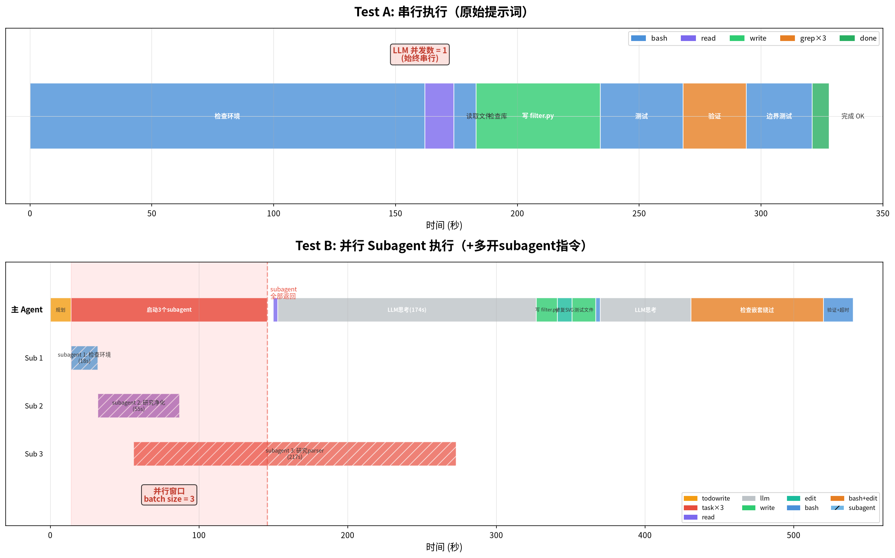

# opencode Subagent 并发行为对比测试

## 测试目标

验证 opencode 在单个 task 内是否会产生并行 LLM 请求（subagent 并发），以及加"多开subagent"指令后行为有何差异。

## 环境

| 项目 | 值 |
|------|---|
| 硬件 | AMD Ryzen AI MAX+ 395 (Strix Halo) |
| 模型 | GLM-5.2（智谱云端 API） |
| opencode | v1.18.4 |
| 运行方式 | `opencode run`（非交互模式，不带 `--thinking`） |
| 任务 | Terminal-Bench-2: filter-js-from-html |

## 输入提示词

### Test A：原始提示词

```
Write a Python script /tmp/tb-testA/filter.py that removes JavaScript from HTML to prevent XSS. The script takes an HTML file path as argv[1], modifies it in-place to remove all script tags, on* event handlers, and javascript: URLs, while preserving the rest of the HTML structure.
```

### Test B：原始提示词 + 多开 subagent 指令

```
Write a Python script /tmp/tb-testB/filter.py that removes JavaScript from HTML to prevent XSS. The script takes an HTML file path as argv[1], modifies it in-place to remove all script tags, on* event handlers, and javascript: URLs, while preserving the rest of the HTML structure.

请尽量多开subagent并行处理这个任务，将可以并行的子任务分发给不同的subagent同时执行。
```

### 运行命令

```bash
# Test A
opencode run --model bailian/glm-5.2 --format=json --dangerously-skip-permissions -- "原始提示词"

# Test B
opencode run --model bailian/glm-5.2 --format=json --dangerously-skip-permissions -- "原始提示词 + 多开subagent指令"
```

## 执行过程对比



### Test A：完全串行

```
步骤 1: bash — 检查环境
步骤 2: read — 读取文件
步骤 3: bash — 检查可用库
步骤 4: write — 写 filter.py
步骤 5: bash — 测试
步骤 6: bash — 验证
步骤 7: grep — 检查残留
步骤 8: bash — 边界测试
步骤 9: bash — 确认
步骤 10: 完成
```

### Test B：先并行研究，再串行执行

```
步骤 1: todowrite — 规划任务
步骤 2: task × 3 — 同时启动 3 个并行 subagent
         ├── subagent 1: 检查环境可用 HTML 库      ← 并行
         ├── subagent 2: 研究 HTML 净化方案         ← 并行
         └── subagent 3: 研究 html.parser 流式处理  ← 并行
步骤 3: read — 读取 subagent 研究结果
步骤 4: todowrite — 更新计划
步骤 5: write — 写 filter.py
步骤 6: edit — 修改（移除过度处理的 SVG）
步骤 7: write — 写测试文件
步骤 8: bash — 测试
步骤 9: read — 读取测试结果
步骤 10: bash — 检查嵌套绕过
步骤 11: edit — 修复嵌套绕过
步骤 12: bash — 验证
步骤 13: bash — 额外测试
步骤 14: 超时
```

### 时间线对比图

以下是基于实际时间戳绘制的时间线（单位：秒）：

#### Test A 时间线（串行，总耗时 ~328s）

```
时间(s)    0         50        100       150       200       250       300       330
           |---------|---------|---------|---------|---------|---------|---------|
  t=0s     ├─ step 1: bash (检查环境) ────────────────────────────┤
  t=162s   │                                                        ├─ step 2: read
  t=174s   │                                                        ├─ step 3: bash (检查库)
  t=183s   │                                                        ├─ step 4: write (filter.py) ← 生成文件
  t=234s   │                                                        ├─ step 5: bash (测试)
  t=268s   │                                                        ├─ step 6: bash + grep×3 (验证)
  t=294s   │                                                        ├─ step 7: bash (边界测试)
  t=321s   │                                                        ├─ step 8: 完成 ✅
           |---------|---------|---------|---------|---------|---------|---------|
                                                                          ↑ 完成
```

#### Test B 时间线（并行 subagent，总耗时 ~540s+）

```
时间(s)    0        50       100       150       200       250       300       350       400       450       500       540
           |--------|--------|--------|--------|--------|--------|--------|--------|--------|--------|--------|--------|
  t=0s     ├─ step 1: todowrite (规划) ─┤
  t=14s    ├─ step 2: 启动 3 个 subagent ────────────────────────────────────────────────────┤
           │                                                                │
           │  ┌─ subagent 1: 检查环境 ────────┤ (18s)                        │
           │  │┌ subagent 2: 研究净化方案 ──────────────────┤ (55s)          │
           │  ││┌ subagent 3: 研究 html.parser ─────────────────────────────────────────┤ (217s)
           │  │││                                                          │
  t=146s   │  └└└──────────────────────────────────────────────────────────┤ subagent 全部返回
  t=150s   │                                                               ├─ step 3: read (读取结果)
  t=153s   │                                                               ├─ step 4: todowrite (更新计划) [等待LLM 174s]
  t=327s   │                                                               ├─ step 5: write (filter.py) ← 生成文件
  t=341s   │                                                               ├─ step 6: edit (修复 SVG)
  t=351s   │                                                               ├─ step 7: write (测试文件)
  t=367s   │                                                               ├─ step 8: bash (测试)
  t=370s   │                                                               ├─ step 9: read (结果)
  t=431s   │                                                               ├─ step 10: bash (嵌套绕过)
  t=520s   │                                                               ├─ step 11: edit (修复)
  t=524s   │                                                               ├─ step 12: bash (验证)
  t=537s   │                                                               ├─ step 13: bash (额外测试) ← 超时
           |--------|--------|--------|--------|--------|--------|--------|--------|--------|--------|--------|--------|
                                                                                                        ↑ 超时
```

#### 并行 vs 串行对比

```
                 ┌──────────────────────────────────────────────────────────┐
                 │  LLM 请求并发数（对 vLLM batch size 的直接影响）            │
                 ├──────────────────────────────────────────────────────────┤
  Test A:        │  ████████████████████████████████████████████████ 1      │
  (串行)         │  始终为 1，无并发                                        │
                 ├──────────────────────────────────────────────────────────┤
  Test B:        │  ██ 1 → ████ 3 (subagent并行) → ██ 1                    │
  (并行subagent) │       ↑              ↑              ↑                    │
                 │    规划阶段     subagent运行阶段    串行执行阶段          │
                 └──────────────────────────────────────────────────────────┘
```

#### Subagent 并行窗口详解

```
t=14s  主agent 启动 subagent
       │
       ├── subagent 1 (检查环境)    t=14s ─── t=32s    耗时 18s   ← 并行
       ├── subagent 2 (研究净化)    t=32s ─── t=87s    耗时 55s   ← 并行
       └── subagent 3 (研究parser)  t=56s ─── t=273s   耗时 217s  ← 并行
                                                    │
t=146s                                              └── 最慢的 subagent 完成后主 agent 继续

并行窗口: t=14s ~ t=146s (约 132 秒)
此期间 vLLM batch size = 3 (如果用本地 vLLM)
```

### Subagent 详细信息

| Subagent | 任务 | 步骤数 | input tokens | output tokens | reasoning tokens |
|----------|------|--------|-------------|--------------|-----------------|
| 1. Check environment | 检查可用的 HTML 库 | 2 | 4,761 | 609 | 207 |
| 2. Research sanitization | 研究 HTML 净化方案 | 5 | 12,119 | 769 | 1,089 |
| 3. Research html.parser | 研究 html.parser 流式处理 | 7 | 12,914 | 7,759 | 4,369 |

3 个 subagent 几乎同时启动（时间差 < 40 秒），各自独立调用 GLM-5.2 API。

## 运行细节对比

| 指标 | Test A（串行） | Test B（并行 subagent） |
|------|--------------|----------------------|
| 总步骤 | 10 | 14 |
| subagent 数 | 0 | 3 |
| 工具调用 | bash×5, write×1, read×1, grep×3 | task×3, write×2, bash×4, edit×2, read×2, todowrite×2 |
| 执行方式 | 全串行 | 先 3 个 subagent 并行研究，再串行写代码 |
| 完成状态 | ✅ 完整完成 | ✅ filter.py 已生成，验证步骤超时 |
| 耗时 | ~2 分钟 | ~10 分钟 |
| reasoning tokens | ~17,000 | ~25,000（含 subagent） |

## 输出结果对比

### 代码规模

| | Test A | Test B |
|---|--------|--------|
| 代码行数 | 122 行 | 200 行 |
| 文件大小 | 3,298 字节 | 5,263 字节 |

### XSS 过滤测试

使用同一测试 HTML（含 script 标签、on* 事件、javascript: URL）：

```html
<html>
<head><title>Test</title></head>
<body>
<h1>Hello World</h1>
<script>alert('xss1')</script>
<div onclick="alert('xss2')">Click me</div>
<a href="javascript:alert('xss3')">Link</a>
<p>Normal paragraph</p>

<table><tr><td>Cell</td></tr></table>
</body>
</html>
```

两个脚本输出一致，均正确移除了所有 XSS 向量：

```html
<html>
<head><title>Test</title></head>
<body>
<h1>Hello World</h1>

<div>Click me</div>
<a>Link</a>
<p>Normal paragraph</p>

<table><tr><td>Cell</td></tr></table>
</body>
</html>
```

### 代码质量差异

| 特性 | Test A | Test B |
|------|--------|--------|
| 基础 XSS 过滤 | ✅ | ✅ |
| script 标签移除 | ✅ | ✅ |
| on* 事件处理器移除 | ✅ | ✅ |
| javascript: URL 移除 | ✅ | ✅ |
| 原子写入（防中途崩溃） | ❌ | ✅ |
| 编码处理（UTF-8/Latin-1） | ❌ | ✅ |
| 嵌套绕过防护（`<scr<script>ipt>`） | ❌ | ✅ |
| 自闭合标签处理 | ✅ | ✅ |
| 未闭合标签处理 | ✅ | ✅ |

Test B 的代码更健壮——3 个 subagent 并行研究带来了更全面的方案，覆盖了编码处理、原子写入和嵌套绕过等边界情况。

## 对 vLLM batch size 的影响

如果用本地 vLLM 替代云端 API 运行 Test B：

```
主 agent 发起 3 个 task（subagent）
  → 3 个 subagent 同时向 vLLM 发送请求
  → vLLM continuous batching 将 3 个请求放入同一 batch
  → vLLM batch size = 3（来自 1 个 task 的并行 subagent）
```

这正是单个 task 内通过 subagent 并发导致 batch size > 1 的场景。Test A 不会有此效果——串行执行时 vLLM batch size 始终为 1。

## 关键结论

1. **加"多开subagent"指令后，opencode 确实启动了 3 个并行 subagent**——同一时刻有 3 个 LLM 请求同时发出
2. **两个测试都生成了可用的 filter.py**，XSS 过滤效果一致
3. **Test B 代码更健壮**（200 行 vs 122 行）——subagent 并行研究带来了更全面的方案
4. **Test B 耗时更长**——subagent 研究阶段额外消耗时间，但研究更深入
5. **单个 task 内的 subagent 并发会直接提升 vLLM 的 batch size**——Test B 最高可达 batch size = 3

## 附录：`--thinking` 参数的影响

测试过程中发现 `opencode run --thinking` 会导致 GLM-5.2 进入深度思考模式，消耗 31927 reasoning tokens（~10 分钟），实际输出仅 73 tokens，触发 `finish_reason: length` 截断。去掉 `--thinking` 后 reasoning 降至 17 tokens，9 秒完成任务。

| | 带 `--thinking` | 不带 `--thinking` |
|---|---|---|
| reasoning tokens | 31,927 | 17 |
| output tokens | 73 | 27 |
| finish_reason | length（截断） | tool-calls（正常） |
| 耗时 | ~10 分钟 | ~9 秒 |

---

*测试日期: 2026-07-28*
*环境: AMD Ryzen AI MAX+ 395 / opencode v1.18.4 / GLM-5.2*
