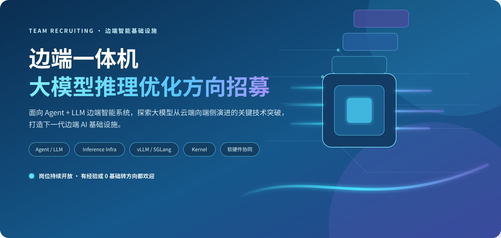
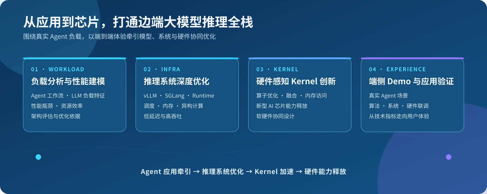
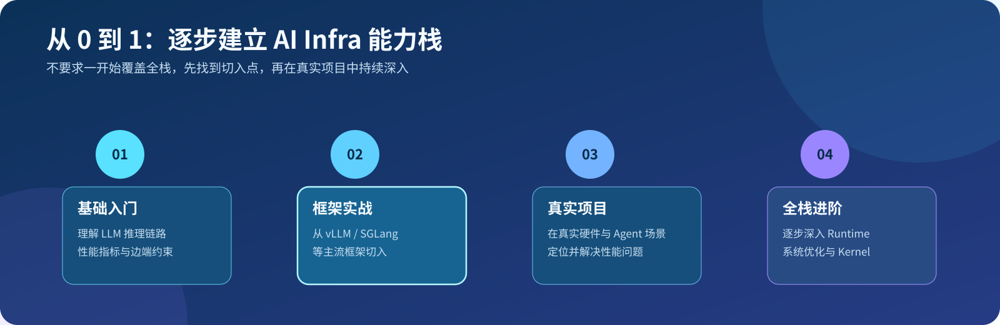
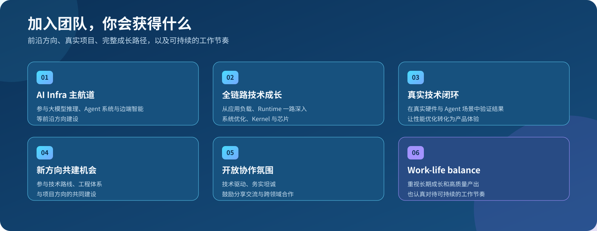

# 【团队招募】边端一体机大模型推理优化方向

> **Agent × LLM × Inference Infra × Kernel**  
> 有相关经验欢迎加入，0 基础转方向同样欢迎。

大模型的下一站，不只是更大的云端集群。

随着 Agent 和 LLM 从云端走向办公、创作与智能终端，一个新的挑战正在出现：

> **如何在有限的算力、内存和功耗条件下，让复杂 Agent 工作流和大模型依然跑得快、跑得稳，并形成真正可感知的产品体验？**

我们正在建设一支面向 **边端一体化大模型系统** 的技术团队，聚焦 **Agent + LLM 推理优化**，从真实应用负载出发，打通模型、推理系统、Kernel 与硬件之间的关键链路，探索大模型从云端向端侧演进的关键技术突破。

这不是把云端方案简单搬到端侧，而是重新思考大模型在新型计算平台上的运行方式。

---

## 我们正在做什么

从 Agent 应用负载一路深入 Runtime、Kernel 与芯片，用端到端体验牵引模型、系统与硬件协同优化。

### 01｜Agent / LLM 负载分析与性能建模

深入分析 Agent 工作流和大模型推理负载特征，研究延迟、吞吐、内存、功耗等关键指标，建立端侧大模型运行性能模型，为系统优化、资源调度和硬件架构设计提供依据。

### 02｜推理 Infra 系统优化

围绕模型调度、内存管理、异构计算和推理 Runtime 等关键方向开展深度优化。深入实践 **vLLM、SGLang** 等主流开源推理框架，探索它们在边端平台上的适配与演进，持续挑战更低延迟、更高吞吐和更优的资源利用率。

### 03｜硬件感知的 Kernel 创新

结合新型 AI 芯片架构，探索算子优化、计算融合、内存访问与并行策略，开发高性能计算 Kernel，让模型特征、推理系统与硬件能力真正协同起来。

### 04｜端侧智能 Demo 与应用验证

将算法创新、系统优化与硬件能力整合到真实 Agent 场景中，通过可运行、可体验的 Demo 验证技术价值，推动想法从技术原型走向实际落地。

---

## 0 基础，也欢迎加入

**没有大模型推理、AI Infra 或 Kernel 经验，也没有关系。**

我们同样欢迎希望转入这一方向的伙伴。不要求每个人一开始就覆盖全栈，团队会提供从基础知识、开源框架实践到真实项目的成长路径。

无论你来自系统软件、计算机体系结构、HPC、编译优化、算法还是应用开发，都可以找到适合自己的切入点。

> **方向可以从 0 学起，好奇心、行动力和持续投入更重要。**

---

## 我们提供

这里不仅有值得深入的技术问题，也有从想法、优化到真实体验的完整闭环。

- **AI Infra 主航道机会：**参与大模型推理、Agent 系统和边端智能等前沿方向建设。
- **全链路技术成长：**从应用负载、推理框架和 Runtime，一路深入系统优化、Kernel 与芯片。
- **真实的技术闭环：**在真实硬件平台和 Agent 场景中验证结果，让优化真正转化为体验。
- **新方向共建机会：**团队处于快速建设阶段，每位成员都能参与技术路线与工程体系的共建。
- **开放协作的团队氛围：**技术驱动、务实坦诚，鼓励分享交流与跨领域合作。
- **Work-life balance：**重视长期技术积累和高质量产出，也认真对待健康、可持续的工作节奏。

---

## 我们期待这样的你

你不需要已经掌握所有相关技术，但希望你：

- 对大模型系统、端侧智能或软硬件协同有持续兴趣；
- 喜欢从数据和底层原理出发定位问题，而不满足于“能跑”；
- 愿意学习、动手实践，并持续拓展自己的技术边界；
- 既愿意把技术做深，也希望技术最终被真实用户感知；
- 乐于分享、坦诚协作，并对结果负责。

以下背景都可以找到合适的切入点：

`大模型推理` · `AI Infra` · `系统软件` · `计算机体系结构` · `GPU / NPU / CPU` · `异构计算` · `Kernel` · `HPC` · `编译优化` · `算法开发` · `Agent 应用` · `0 基础转方向`

---

## 加入我们

如果你希望站在 **Agent、LLM 与新型 AI 计算平台的交叉点**，和我们一起探索下一代边端智能基础设施，欢迎加入。

> **岗位持续开放，有经验或 0 基础转方向都欢迎私聊交流。**

📮 **联系方式：** 请替换为团队联系人 / 内部职位链接

---

**EDGE AI · AGENT + LLM · INFERENCE INFRA**

